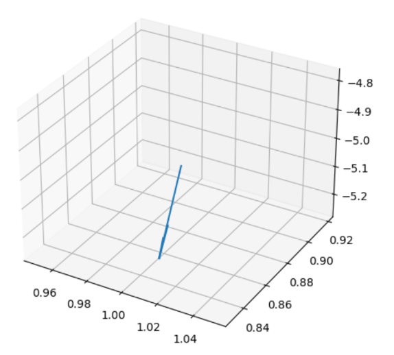
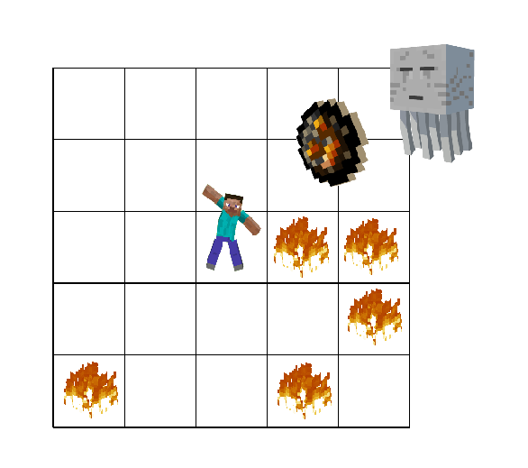
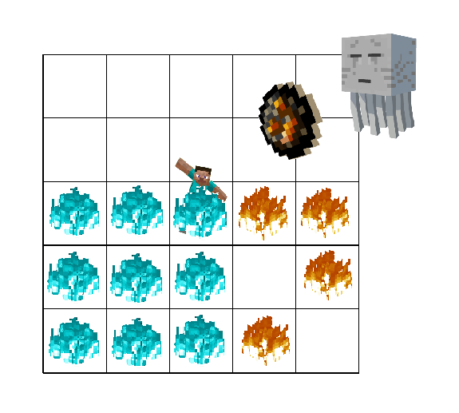
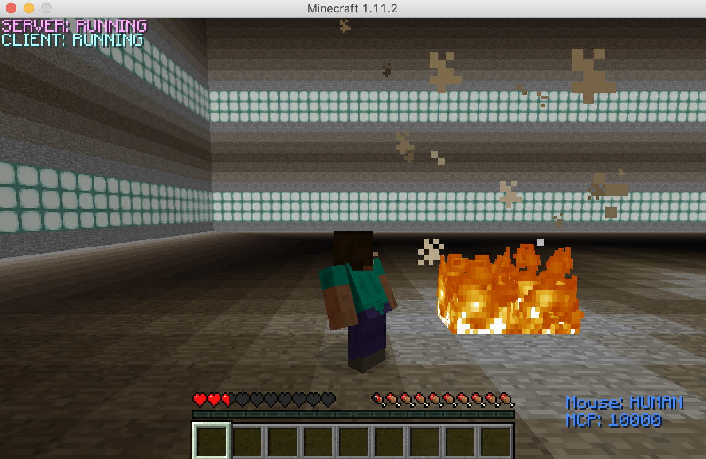
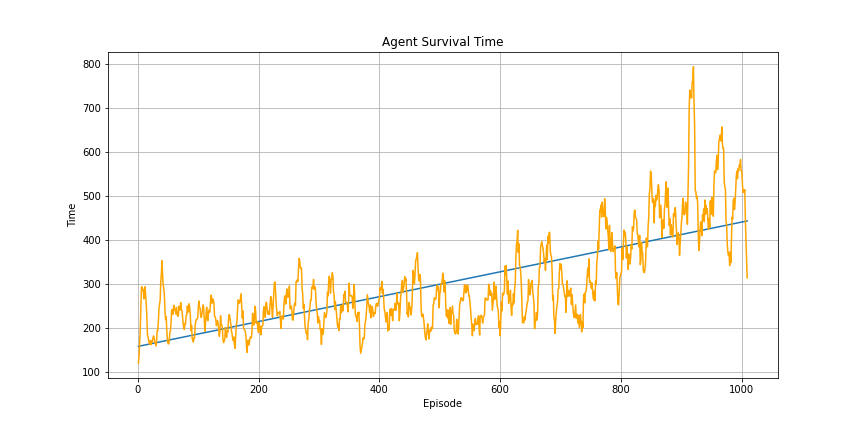
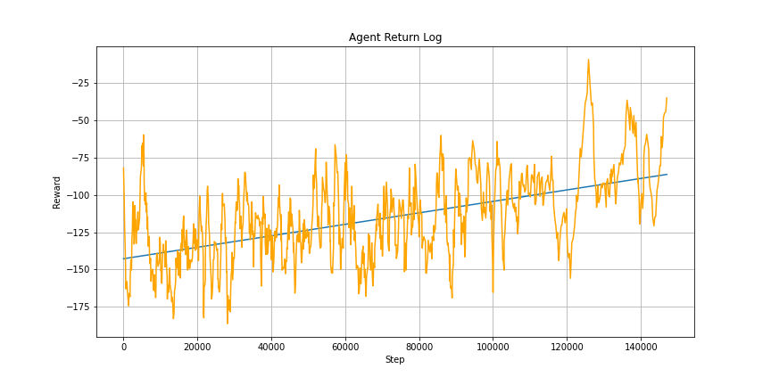
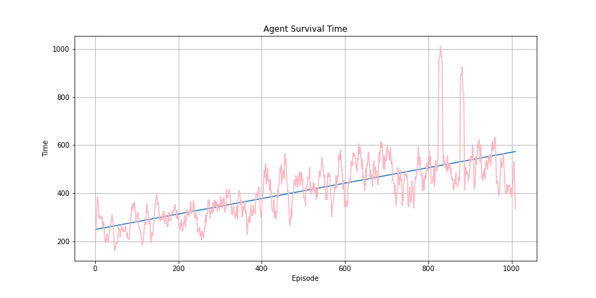
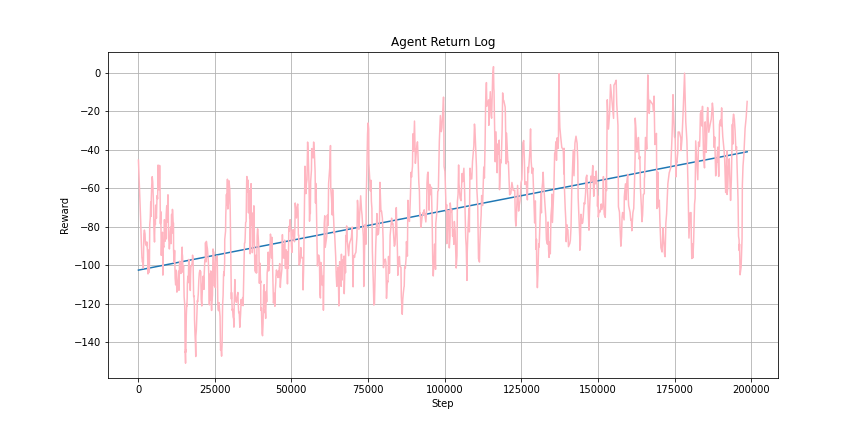

## Video [TODO]

## Project Summary:  [TODO]
  We implemented a game called CrossTheFireLine, similiar to the Dodge Ball; the agent should learn to avoid getting hit by the fireball from the Ghast as well as  to avoid stepping on the fire block. A ghast that can shoot fireballs will appear in the air and move randomly. When fireball falls to the ground, the stone will be set on fire and these blocks will convert into fire blocks. If the agent steps on the fire or get git by the fireball, it will receive the negative reward. Both our agent Steve and the Ghast's activity space will be limited inside the 60 x 60 area, surrounded by sand walls. Steve needs to observe his surroundings and avoid getting negative reward so that he can survive for longer time. 
  
  The output of the algorithm should be the list of [continuous] movements.
  
## Approach: [TODO]
In order to prevent the agent from walking aimlessly, we confine the agent and ghast to a three-dimensional space. Ghast will continuously shoot fireballs at the agent, and the agent can perform [continuous] actions to avoid the fireball.

Firstly,we decided to observe the coming of the Fireball from the end point of the Fireball using Matplotlib, using the function ax.quiver, with parameters(x,y,z,motionX,motionY, motionZ) can calculated the needed information, and the graph is showed by

 
(Figure 1: start and end points of fireball)
 
 
We first modified the observation space to ensure that the information of fire block location can be passed to the agent. Our first attempt was to create a new fireball observation space to store areas that will be in fire soon (after ghast shoot the fire ball). That is, when calling get_observation() method, the agent will receive two arrays. However, we later found that the agent's performance did not improve during training, so we speculated that the agent might not be able to distinguish between the two arrays, original observation space and fire_ball observation space. Therefore, we re-design our code to incorporate the information of the fireball observation space into the original observation space using logical_or in NumPy. Finally, we applied the Proximal Policy Optimization (PPO) to train our agent.

 
(Figure 2: The original observation space)
 

 
(Figure 3: The combination of fire_ball observation space and original grid observation space)

### Setup an Environment

 
(Figure 4: Environment setup)

### Action
The Ghast can hit several blocks by launching single fireball, so if the agent only take discrete movement, its chances of avoiding the fireball are reduced. Hence, we believe the better choice is to let the agent have continuous movements.

### Action Space
self.action_space = Box(low = -1, high = 1, shape=(2,))  # move, turn
 
Our agent continuous action space cantains two kinds of actions, move [-1,1] and turn [-1,-1]. When the agent detects the fire on the grid in the observation space, it will use yaw and different commands to avoid the fire.

### State [TODO]
The observation space of our discrete agent is a 5 x 5 grid that contains the information about the nearby fire blocks (including those blocks that will be set on fire by the fireball soon). 

The continuous agent receives an array containing the location and orientation of the agent, and the locations of the nearby fire blocks (including the blocks that will be hit by the fireball) as the state observation.

### Reward
Our agent receives a negative reward whenever he touches the fire. We also give a negative reward when the agent's health points decrease.  
One of the important metrics we use for evaluation is the survival time per episode. An episode ends after sending 1000 commands or when the agent dies. Our goal of this project is to let the agent learn how to avoid the fire on the floor and survive longer under the attack of the ghast. Therefore, we give a higher reward to the agent if he survives for a longer time.

### Baseline
To see how well the agent performs, we wrote the baseline for comparison. The baseline is allowing agent to only view the nearest block left, right, front, and back. We declare the empty list for storing the safe block and another list to store all moves in 4 different directions. If the left block is NOT occupied by the fire, the turn left command will be added to the safe_block list. Similarly, all other 3 blocks applied the same rules. After the verification, we make agent randomly pick the command in the safe_block list, which means any command in the list will lead to the safe move. However, if 4 nearest blocks are full of fire, agent would have no choice but torandomly pick one command and execute it. We regard the baseline as a minimum standard; our agent must perform better than the baseline result, and has the basic consciousness not to step on the fire.

### Training model
<ul>
  <li>PPO algorithm</li>
 
After reviewing the academic papers of PPO, we have some basic understaning of Proximal Policy Optimization (PPO). PPO is the extended version of Policy Gradient algorithm. The Policy Gradient algorithm is sensitive to the step size, but it is difficult to determine the proper step size. If the difference between the original and the new strategy change alot, it is not conducive for agent to learn. PPO proposes a new function to make sure that an update of the policy won't change too much, which solves the problem in Policy Gradient algorithm.
We choose this algorithm since it can be used for environments with either discrete or continuous aciton spaces.
</ul>
 

 
(Figure 5: PPO algorithm)

## Evaluation: 
We will use both quantitative and qualitative methods to evaluate out AI and show how our agent operates. 

### Quantitative Evaluation: [TODO]

We have two measurments. The following graphs show how the agent’s survival time and the reward vary as the training step increases.
In the code, we also have a lot of data to quantify rewards and agent performance. For example, the distance between the fireball, the number of lives lost, the command sent, different types of blocks the agent stands on.
It is easy to see from these two graphs that the untrained agent dies easily, but as the number of training sessions increases, the agent finds a way to survive longer. 

 
(Figure 6: Survival Time with Continuous Observation Space)
 

 
(Figure 7: Return with Continuous Observation Space)

 
(Figure 8: Survival Time with Discrete Observation Space)
 

 
(Figure 9: Return with Discrete Observation Space)

### Qualitative Evaluation:

We can evaluate the agent based on how long it survives for each game playing. As the training time increases, the agent should be able to dodge fireballs and avoid fire blocks more often, which therefore can increase the survival time. 
By observing our agent playing the game, we can conclude that whether the agent is learning how to dodge the fireball and avoid the fire on the ground, or whether he is behaving randomly. 

## Reference:
We used the class material and assignment2 as a start up. 
 
- [Malmo XML](http://microsoft.github.io/malmo/0.30.0/Schemas/MissionHandlers.html#SchemaPropertiesv)
- [Malmo project documentation Github](https://github.com/microsoft/malmo)
- [PPO.PPOTrainer parameters](https://medium.com/aureliantactics/ppo-hyperparameters-and-ranges-6fc2d29bccbe)
- [PPO github](https://github.com/gzrjzcx/ML-agents/blob/master/docs/Training-PPO.md)
- [Matplotlib for plotting path](https://matplotlib.org)
- [Numpy Documentation](https://numpy.org)
- [RLlib environment](https://docs.ray.io/en/latest/rllib-env.html)
- [PPO Algorithm](https://arxiv.org/pdf/1707.06347.pdf)
